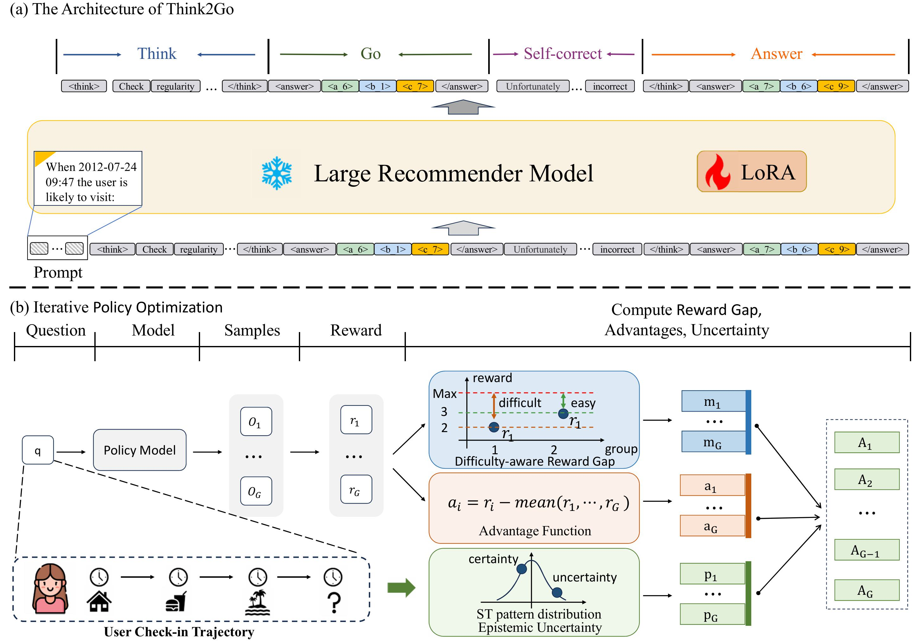
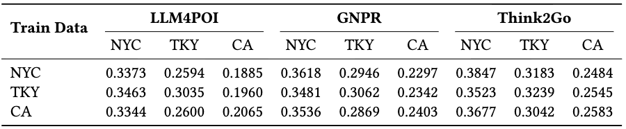

# Think2Go: Generative Next POI Recommendation with LLM Reasoning
## Introduction
Think2Go is a novel generative next POI recommendation framework, which enhances the model’s comprehension of SID representations and explores diverse spatial-temporal patterns via test-time computational scaling.
We unify supervised fine-tuning (SFT) and reinforcement learning (RL)-based reasoning within a single architecture, enabling joint optimization of memorization and adaptive reasoning to better retain user behavior patterns while exploring diverse user preferences.


## Dataset
We can prepare our SID dataset through the following link:
```sh
git clone https://github.com/wds1996/GNPR-SID
```

## Supervised Fine-tuning
Run reasoning.sh or the following commands:
```sh
CUDA_VISIBLE_DEVICES=0,1,2,3,4 nohup nice -n -10 \
torchrun --nproc_per_node=4 reasoning.py \
	--model_name_or_path ./Llama-3.1-8B \
	--peft_model_path None \
	--bf16 True \
	--output_dir ./restart \
	--model_max_length 2048 \
	--use_flash_attn True \
	--data_path data/NYC/data/train_codebook_with_difficulty.json \
	--low_rank_training True \
	--num_train_epochs 3 \
	--per_device_train_batch_size 1 \
	--per_device_eval_batch_size 2 \
	--gradient_accumulation_steps 1 \
	--eval_strategy "no" \
	--save_strategy "steps" \
	--save_steps 1000 \
	--save_total_limit 5 \
	--learning_rate 2e-5 \
	--weight_decay 0.0 \
	--warmup_steps 20 \
	--lr_scheduler_type "constant_with_warmup" \
	--logging_steps 1 \
	--deepspeed "ds_configs/stage2.json" \
	--tf32 True \
	--wandb_name "restart" \
> restart/output.log 2>&1 &
```


## Evaluation
Run test.sh or the following commands:
```sh
CUDA_VISIBLE_DEVICES=0 nohup python eval_vllm.py 
	--model_path ./Llama-3.1-8B 
	--dataset_name nyc 
	--output_dir ./restart/checkpoint 
	--test_file "datasets/NYC/data/test_codebook_origin.json" 
> restart/test.txt 2>&1 &
```


## Out-of-domain Analysis Results
Think2Go exhibits smaller performance degradation on out-of-domain datasets compared to other methods, further demonstrating its superior generalization ability.



